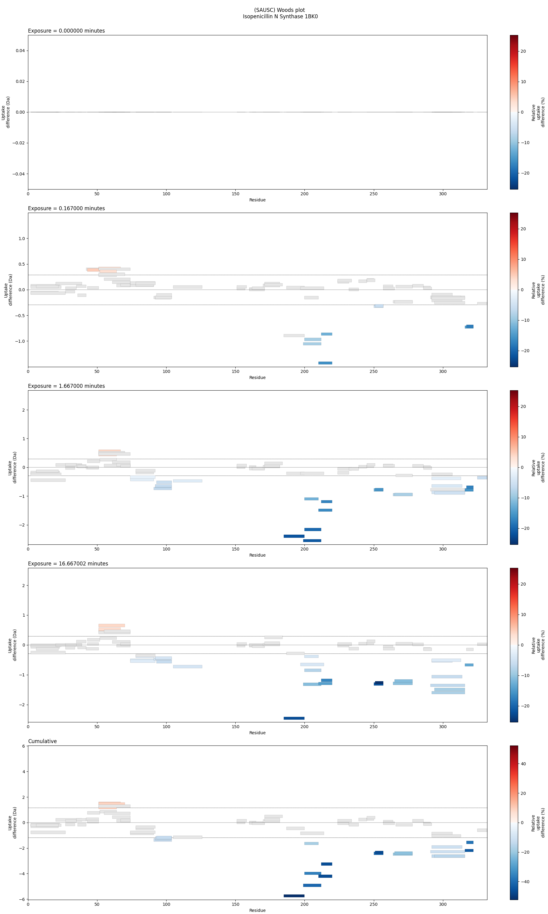

# Sequence Averaged Uptake State Comparison (SAUSC)

## Overview

SAUSC is a standalone python scipt designed to analyze Hydrogen-Deuterium Exchange Mass Spectrometry (HDX-MS) data directly from PyMOL. It facilitates loading, processing, and statistical analysis of HDX-MS data, and supports visualizing results through the Woods and Volcano plots. Differences between states will be drawn directly onto your protein structure within PyMOL with a gradient colourmap.

## Installation

Requirements:
- PyMOL 3.0+ (for integration)

Install required Python libraries within PyMOL by running:
```
pip install numpy matplotlib scipy
```

## Usage


1. Fetch your desired protein structure within PyMOL.

2. Load the script through PyMOL via File -> Run Script...

3. Navigate to your local SAUSC directory and select main.py

4. With SAUSC now loaded within PyMOL's environment, run the following command:
```
SAUSC n_repeats=3, confidence_interval=0.95, normalisation_mode=ACROSS_EXPOSURES
```
SAUSC takes several arguments to customise the analysis:
| Argument                 | Default          | Purpose                                                                                        |
|--------------------------|------------------|------------------------------------------------------------------------------------------------|
| filepath                 | None             | Path to the HDX-MS data file. Not supplying a filepath will open a file browser.               |
| n_repeats                | 3                | Number of repeats in the HDX-MS experiment. This must be set correctly for your data.          |
| confidence_interval      | 0.95             | Statistical confidence interval for analysis.                                                  |
| statistical_test         | HYBRID           | Type of statistical test to perform. Options are T_TEST, GLOBAL, or HYBRID                     |
| protection_colourmap     | Blues            | Colour map for protected areas. Must be a sequential colourmap (reference)                     |
| deprotection_colourmap   | Reds             | Colour map for deprotected areas. See above.                                                   |
| insignificant_colour     | (0.9, 0.9, 0.9)  | Colour (RGB values) for insignificant results. Default is a slight gray.                       |
| no_coverage_colour       | (0.1, 0.1, 0.1)  | Colour (RGB values) for areas with no coverage. Default is black.                              |
| normalisation_mode       | ACROSS_EXPOSURES | Mode of normalisation for colour mapping. Options are INDIVIDUAL, ACROSS_EXPOSURES, or GLOBAL. |


5. Once SAUSC has run with your desired settings, there will be a scene populated for each exposure time:


## Accessory figures

After SAUSC has been run on data, extra plotting functions will be populated inside the pymol namespace for the latest analysis.
These can be invoked using the commands:

```
woods_plot
```

Which will produce the figure:


and:

```
volcano_plot
```

Which will produce the figure:


## Contact
For queries, contact Josh Bishop at joshualiambishop@gmail.com.
